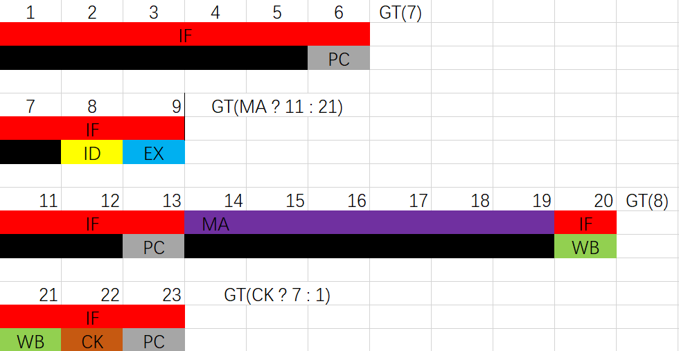

# RISCV开发文档——刘珺琪
------
此次RISCV的开发过程坎坷，分为如下几个阶段。

最开始尝试直接写五级流水，粗略的看过《自己动手写CPU》认为其实现方法过于不优美，故遗弃。在约两个星期的不懈努力之后，终于因逻辑混乱不断打补丁导致逻辑越发混乱而删库。

而后便开始从最简单的结构入手——串型无流水结构。因为对线路原件、内存的用法性能、RISCV指令集的理解不够，花费的时间比想象的更久。最终的产物是一个单模块设计的大量使用 **assign** 语句的丑陋设计，不过所幸能通过大部分的正确性测试。

进一步的阶段是在不考虑 **Hazard** 的情况下分别实现 **IF、ID、EX、MA、WB** 并将其串型相接，即不并行运行。其中 **IF、MA** 在其使能信号打开的第六个周期能输出结果、 **ID、EX、WB** 则在其使能信号打开的第一个周期既能输出结果。

这样写出两种构架之后加深了对该工程的理解，在不把简单或不太简单的逻辑运算拆周期运行，即不把 **ID、EX、WB** 拆为多周期的前提下，在不使用 **cache** 的情况下，运行效率的瓶颈在于内存的访问，即 **IF、MA** 两个阶段。而剩下的诸多环节甚至不必要进行并行效率仍然足以，故决定实现一个双线程的流水线。 **IF、MA** 与 **ID、EX、MA** 并行，并进行一些简单的分支预测提前提取指令使内存利用率达到了 **100%** 。而这样的设计甚至不会出现 **Data Hazard** ，因为每条指令的 **ID** 都能等到上一指令的 **WB** 之后再执行而不影响流水线速度。在实现过程中通过一个简单的状态机使得问题得到完美解决。

在最后一次的编写过程中几乎没有使用 **always @(\*)、assign、multi_driver** 希望之后可以直接上板运行。在综合烧录的时候十分顺利，能够直接跑出无 **sleep** 函数程序的结果，含 **sleep** 函数的程序明显休眠时间过长。经检查后发现是 **hci** 模块与 **ram** 模块读取数据的延迟差异导致的，纠正之后便有了良好的正确性，频率能达到140MHz。
